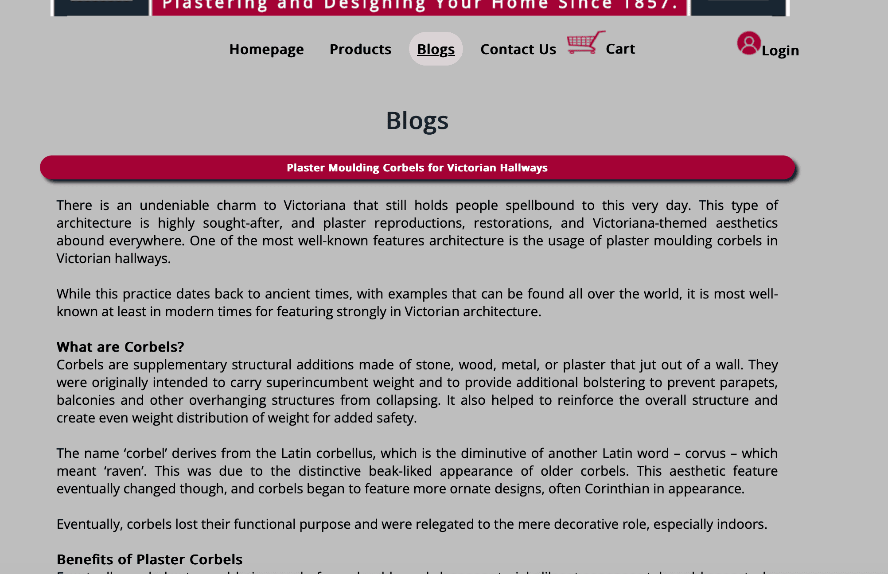
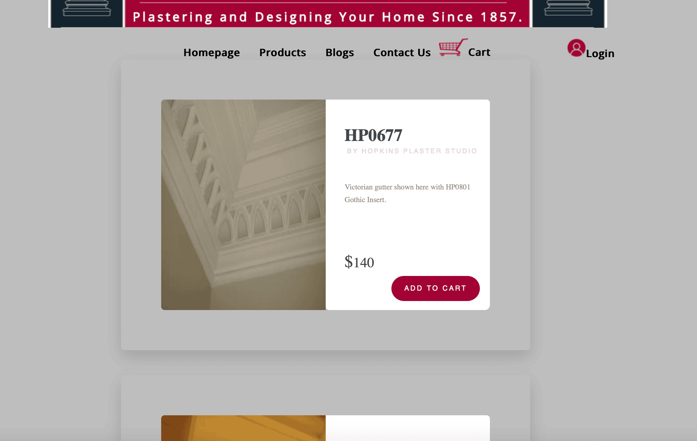
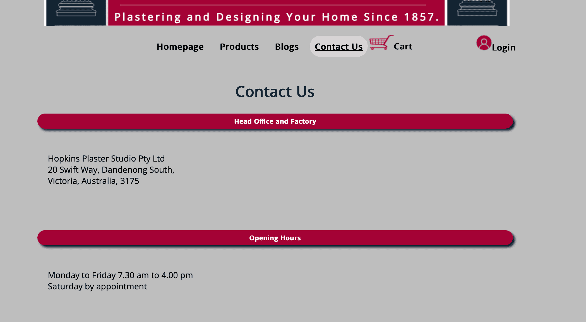
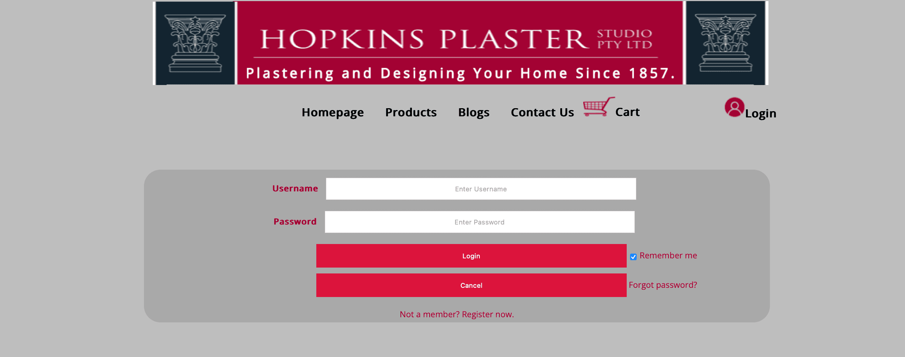
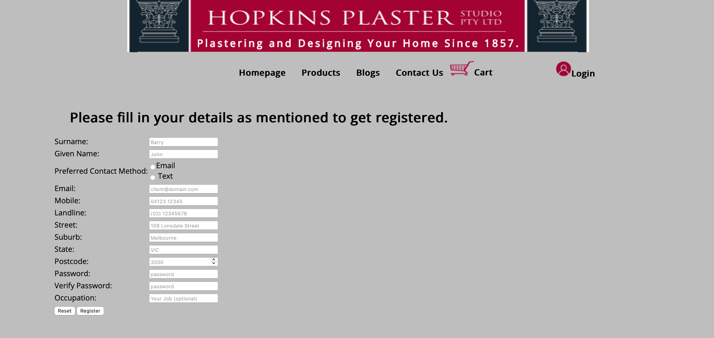
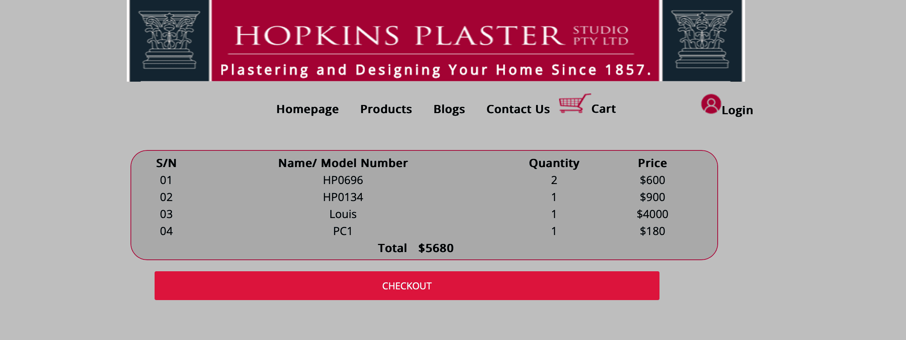

# README

## Project Overview

This project is a demo website for a plastering company, Hopkins Plaster Studio. The website provides information about the company, its products, and services. It also includes a blog section where users can read about various topics related to plastering and architecture. The website has a login system for users to create accounts and a shopping cart feature for purchasing products.

## Demo Images

### Home Page

### Blogs Page

### Products Page

### Contact Page

### Login Page

### Register Page

### Cart Page

### Checkout Page

## Features

- **Home Page**: Displays general information about the company and its services.
- **Blogs Page**: Contains blog posts about plastering and architecture.
- **Items Page**: Showcases the products offered by the company. Users can add products to their cart.
- **Login Page**: Allows users to log in to their accounts.
- **Profile Page**: Displays user profile information.
- **Forget Password Page**: Provides a way for users to reset their forgotten passwords.

## How to Run the Project

This project is built with PHP and HTML, so you will need a local server like Apache to run it. You can use XAMPP, which includes Apache and other useful services like MySQL and PHPMyAdmin.

Here are the steps to run the project using XAMPP:

1. Download and install XAMPP from the official website: https://www.apachefriends.org/index.html
2. Copy the project files into the `htdocs` folder in your XAMPP installation directory.
3. Open the XAMPP control panel and start the Apache service.
4. Open a web browser and navigate to `http://localhost/your_project_folder` to view the website.

Please note that if you want to use the login system or any other feature that requires a database, you will also need to set up a MySQL database using PHPMyAdmin or another tool. The database configuration details should be updated in the relevant PHP files.

## Contributing

This is a demo project, and contributions are welcome. Feel free to fork the project and submit pull requests. Please make sure to test your changes thoroughly before submitting.

## License

This project is licensed under the MIT License.
